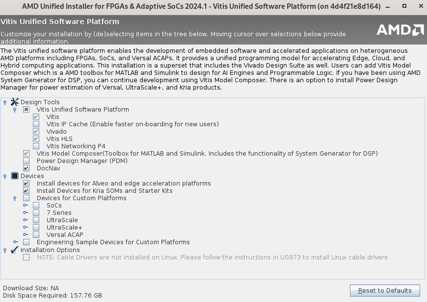

# Vivado, Vitis 2024.1

This image is based on Ubuntu 22.04 and uses a multi-stage build process to
minimize the final image size as much as possible.

The build process has been tested with Docker, but the resulting image is
compatible with both Docker and Podman.

## Tests

This container image has been tested for the following use cases. Please note
that test coverage is limited and primarily manual. If you encounter any issues,
feel free to open an issue. Likewise, if you test a use case not listed
here—whether it works or not—please let us know so we can update and expand the
table accordingly.

| Scenario | Podman (CI) | Podman (GUI) | Docker (CI) | Docker (GUI) | Comments | Tested Version(s) |
| -------- | ----------- | ------------ | ----------- | ------------ | -------- | ----------------- |
| Run Vivado, Vitis, Vitis Classic | ❓ | ✅ | ✅ | ✅ | Just open the tool(s) and close | `20250426-0` |
| Vivado MicroBlaze Example Project | ❓ | ✅ | ❓ | ✅ | Create (classical) MicroBlaze example project for Artix-7 AC701 board with several IPs AXI GPIO, AXI I2C etc., finish to bitstream generation | `20250426-0` |
| Vivado Zynq 7000 Example Project | ❓ | ❓ | ❓ | ✅ | Create Zynq 7000 example project for ZC-702 board with several IPs AXI GPIO, AXI I2C etc., finish to bitstream generation | `20250426-0` |
| Vivado ZynqMP Project | ❓ | ✅ | ✅ | ❓ | Custom project, finish to bitstream generation | `20250426-0` |

- ✅: Tested and works well
- ❓: Not tested yet
- ❌: Tested but doesn't work well

### Notes

- Tests are expected to be backward compatible—that is, if an older version of
  the tool works correctly in a given scenario, newer versions should work as
  well.
- The final image can be used both in `CI` environments (headless, via
  Bash/TCL/Python scripts) and interactively by users in a desktop environment
  with `GUI` interfaces.

## How to build the image?

On a reasonably powerful machine with an SSD, the build takes approximately 135
minutes when using the `--no-cache` option. The size of the final image is
apporximately 110 GB but this will heavily depend on `install_config.txt` as it
will be introduced later.

### 1️⃣ Get the installation file

First download the installation file from Xilinx's web site. The correct name is
`FPGAs_AdaptiveSoCs_Unified_2024.1_0522_2023.tar.gz`, MD5 checksum is
`372c0b184e32001137424e395823de3c` and approximate size is `115 GB`. Place that
file in the same directory as this `README.md` file.

### 2️⃣ (Optional) - Modify `install_config.txt` or create from scratch

The `install_config.txt` file controls which components (e.g., Vivado, Vitis,
HLS) will be installed, and which device families (e.g., 7-Series, UltraScale+,
Versal) will be supported in the final image. The provided default
`install_config.txt` installs the most commonly used tools and device families.
Some newer or less frequently used options—such as Versal, RFSoCs, and
Engineering Sample devices—are excluded by default to help keep the final image
size as small as possible.

You can easily customize this file to suit your needs. Simply open
`install_config.txt` in a text editor and modify the `Modules` options.

> ⚠️ **Do not delete any lines.** To disable a module or device, change its
> value from `1` to `0`
>
> ✅ For example, to disable Virtex-7 support, change `Virtex-7:1` to
> `Virtex-7:0`.
>
> ➕ To enable a device that is disabled by default, such as a line marked
> `Device:0`, change it to `Device:1`.

**Keep in mind that enabling additional devices will increase the final image
size.**

---

**Alternatively,** you can generate a custom `install_config.txt` from scratch.
This is useful if you want to customize not only the device families, but also
the software components to be installed (e.g., Vivado, Vitis, etc.). However,
this approach involves a few extra steps.

To create the file, you'll need to run `xsetup`—the installer executable found
inside the `.tar.gz` setup archive—with the `-b ConfigGen` option. This will
generate an `install_config.txt` for use during the final build.

> ⚠️ **Note:** To minimize image size, `xsetup` is *not* included in the final
> container image. Therefore, you have two options:

#### 1. Generate it on another (or the same) machine (EASIER)

- Extract the `.tar.gz` setup file.
- Run: `xsetup -b ConfigGen`.
- Copy the generated `install_config.txt` into your build context.
- This step can be done on either a Linux or Windows machine. Since
  `install_config.txt` appears to be OS-agnostic, the host OS doesn’t need to be
  officially supported by Xilinx—as long as `xsetup` runs and generates the
  config file successfully.

#### 2. Use a separate container to generate the file

- We will provide a dedicated container image just for running `xsetup -b
  ConfigGen`.
- This method allows Docker to reuse cached layers between the config generation
  step and the final build, saving time and space.
- Additionally, you don’t have to manually extract the `.tar.gz` file—Docker
  handles it for you.
- However, this approach does involve some extra setup steps, which will be
  documented now.

The provided `Dockerfile-setup` is used to build a temporary container image for
generating `install_config.txt`. If you examine it closely, you’ll notice that
it is nearly identical to the top portion of the main `Dockerfile`. This
similarity is intentional—it allows Docker to reuse cached layers between the
setup and final build processes, significantly speeding things up.

To build this temporary image, run the following command:

```bash
sudo docker build --file Dockerfile-setup --tag vivado:2024.1-setup .
```

> ⏱️ The build duration will vary depending on your hardware. On a typical
> machine, it may take some time to complete.

One option is to use the Vivado installer in batch (text) mode. To do this, you
simply need to run the container and execute `xsetup` with the appropriate
option:

```bash
sudo docker run --rm -it vivado:2024.1-setup
```

Once inside the container, run:

```bash
/tmp/installer/xsetup -b ConfigGen
```

This will launch the batch mode installer and generate the `install_config.txt`
file. You should see a prompt similar to the following:

```text
root@26eeb8369ffe:/# /tmp/installer/xsetup -b ConfigGen
This is a fresh install.
INFO Could not detect the display scale (hDPI).
       If you are using a high resolution monitor, you can set the insaller scale factor like this:
       export XINSTALLER_SCALE=2
       setenv XINSTALLER_SCALE 2
Running in batch mode...
Copyright (c) 1986-2022 Xilinx, Inc.  All rights reserved.
Copyright (c) 2022-2025 Advanced Micro Devices, Inc.  All rights reserved.

Select a Product from the list:
1. Vitis
2. Vivado
3. Vitis Embedded Development
4. BootGen
5. Lab Edition
6. Hardware Server
7. Power Design Manager (PDM)
8. On-Premises Install for Cloud Deployments
9. PetaLinux
10. Documentation Navigator (Standalone)

Please choose:

Please choose: 1
INFO  - Config file available at /root/.Xilinx/install_config.txt. Please use -c <filename> to point to this install configuration.
```

After selecting the components you want to install, the `install_config.txt`
file will be generated at:

```text
/root/.Xilinx/install_config.txt
```

To view its contents, simply run:

```bash
cat /root/.Xilinx/install_config.txt
```

Then, copy and replace the default `install_config.txt` in your project
directory with this newly generated version.

```text
root@26eeb8369ffe:/# cat /root/.Xilinx/install_config.txt
#### Vitis Unified Software Platform Install Configuration ####
Edition=Vitis Unified Software Platform

Product=Vitis

# Path where AMD FPGAs & Adaptive SoCs software will be installed.
Destination=/tools/Xilinx

# Choose the Products/Devices the you would like to install.
Modules=...
...
```

As you might have noticed, the installer doesn't ask many questions—only which
software components (e.g., Vivado, Vitis) to install. It does **not** prompt for
device families. Therefore, you’ll still need to manually edit the device
options in `install_config.txt`, as explained earlier.

In addition, make sure to apply the following edits in **all cases**:

```text
Destination=/opt/Xilinx
```

and

```text
EnableDiskUsageOptimization=0
```

You **can** leave `EnableDiskUsageOptimization` set to `1`, but based on
experience, this may increase installation time and can even cause the installer
to hang. Since each container includes only one Vivado installation (not
multiple versions), this optimization is unlikely to be useful. That’s why I’ve
chosen to leave it at `0` by default—though the exact impact of this setting
isn’t fully confirmed.

See more: <https://adaptivesupport.amd.com/s/feed/0D52E00006hpmTCSAY>

---

Creating `install_config.txt` does **not** provide any indication of the final
image size. This is where the **GUI installer** can be helpful—it allows you to
visually see how including or excluding specific components impacts the total
installation size.

Unfortunately, as far as I know, the GUI installer **cannot** be used to
generate `install_config.txt`. So its usefulness is limited to estimating the
image size based on selected devices and components.

To use the GUI installer, the Docker container must have access to your host
machine’s **X server**. The following setup has been tested on Linux
distributions using **X11 Server** (not Wayland):

First, allow Docker to access your X server:

```bash
xhost +local:docker
```

Then, run the container with access to the X server:

```bash
sudo docker run --rm -it \
  -v /tmp/.X11-unix:/tmp/.X11-unix:ro \
  -e DISPLAY=${DISPLAY} \
  vivado:2024.1-setup
```

Inside the container, run the installer:

```bash
/tmp/installer/xsetup
```

You should be greeted by the Vivado installation splash screen, where you can
visually select components and see estimated disk usage.


You can estimate the size of the final image by adding and removing desired components.



> ⚠️ **Important:** Do **not** proceed with the installation in GUI mode.

The GUI installer is only intended for **estimating the final image size** based
on selected components. Once you're done with your assessment, **exit the GUI
installer** without starting the installation.

Then, modify the `install_config.txt` file accordingly based on your needs
(e.g., enabling/disabling device families or components as explained earlier).

Vivado will be installed **later during the Docker build**, using **batch
mode**, based on this configuration file.

### 3️⃣ Build the image

Now we are ready to build our image.

This document outlines the steps using `docker build`. As mentioned earlier, the
final image is **OCI-compliant** and can be run using **Docker** or **Podman**.
However, the **build process has only been tested with Docker**—tools like
**Buildah** have **not** been tested.

If Docker is not already installed on your system, please refer to the [official
Docker installation guide](https://docs.docker.com/get-docker/) to set it up.

---

If you're behind a firewall, want to use a local APT repository for better
performance, or are working in an air-gapped environment, you may want to change
the APT repositories used during the build. There are three files that control
this:

- `sources-stage-1.list`
- `sources-stage-2.list`
- `sources-final.list`

If any of these files begin with a line containing `#ignore`, that file will be
skipped by the `replace_sources.sh` script, and the default APT sources from the
base Ubuntu image will be used instead. To customize, simply remove the
`#ignore` line and add your repository entries, or create a hard link to a
different sources list file.

The build process consists of two main stages:

- **Stage 1** installs Vivado and only includes the minimal packages required.
  It uses `sources-stage-1.list`.
- **Stage 2** prepares the final container image by copying Vivado from Stage 1
  and cleaning up installation files (like the `.tar.gz` archive and extracted
  directories) to reduce the final image size. This stage uses
  `sources-stage-2.list`.

Finally, `sources-final.list` is used for the last layer of the build, which may
be helpful if your **build-time** and **runtime** environments differ and you
want to configure separate APT sources for runtime.

If you have unrestricted internet access, you can safely leave these files unchanged.

---

To ensure consistency and traceability, it's recommended to tag the Docker image
using a versioning format like `YYYYMMDD-<COUNT>`. This helps track different
builds clearly and aligns with OCI-compatible tagging.

Follow the steps below:

```bash
# Define a version tag
TAG=YYYYMMDD-<Count>  # Change this to match the current date and build count like 20250424-1

# Build the Docker image with tagging and log output
sudo docker build \
  -t vivado:2024.1-$TAG \
  --build-arg EBOX_OCI_VERSION="$TAG" \
  --progress=plain . \
  2>&1 | tee build.log
```

This will build the image, tag it as `vivado:2024.1-$TAG`, and log all output
into `build.log` for easier debugging and reference.

**⚠️ Warning:** The build process can take **several hours** depending on your
machine’s hardware — especially disk speed (SSD recommended) — and your internet
connection. Since some dependencies are installed from Ubuntu repositories
during the build, slower internet may further increase the build time.

## 4️⃣ Testing the image

First, verify that the `TAG` value was correctly embedded into the image by
running the following command:

```bash
sudo docker run --rm -it --user ebox vivado:2024.1-$TAG printenv EBOX_OCI_VERSION
```

```text
sudo docker run --rm -it --user ebox vivado:2024.1-$TAG printenv EBOX_OCI_VERSION
No USER_ID or GROUP_ID provided. Running as ebox...
YYYYMMDD-<Count>
```

The output should match the `TAG` value you defined during the build process.
This confirms that the image was tagged correctly and that the
`EBOX_OCI_VERSION` environment variable was properly set.

Also, verify that the image is tagged correctly and you're using the expected
version. You can inspect the image with the following command:

```bash
sudo docker inspect vivado:2024.1-$TAG | grep EBOX_OCI_VERSION
```

```text
sudo docker inspect vivado:2024.1-$TAG | grep EBOX_OCI_VERSION
                "EBOX_OCI_VERSION=YYYYMMDD-<Count>",
```

You should see the same `TAG` value as the one you used during the build. This
ensures that the correct version metadata is embedded in the image.

---

At this point, you can optionally push your container image to a container
registry such as Docker Hub, JFrog Artifactory, Sonatype Nexus, GitHub, or
GitLab Container Registry. However, keep in mind that the image size can be a
significant issue—many registries have storage limits or pricing tiers that may
affect your decision.

Before pushing, you can check the image size with:

```bash
sudo docker inspect -f "{{ .Size }}" vivado:2024.1-$TAG
```

For example, a result like:

```text
110921560846
```

indicates the image is over 100 GB in size!

Be sure to review the limitations and costs associated with your registry of
choice before uploading.

## 5️⃣ Running the image - Let's the fun begin!

Now that the image is built, it’s ready to be used with your projects. As
mentioned previously, the image is OCI-compliant, meaning it can be run using
Docker, Podman, or any other OCI-compatible runtime. It supports both CI
(headless) and desktop (GUI) workflows.

While Docker and Podman offer similar interfaces, their implementations differ
under the hood. For desktop use—especially for interactive GUI applications—both
tools work well, though I personally lean slightly toward Podman, particularly
in multi-user environments where its rootless mode offers better security and
isolation.

For CI workflows, Docker tends to be more commonly used, as many CI systems are
built around Docker's APIs and behaviors. That said, the choice of tool
generally doesn't matter—either should work for most use cases.

The following section provides example commands and configuration files for
various usage scenarios.

---

### Running with Docker on desktop to test

```shell
$ sudo docker run --rm -it --user ebox vivado:2024.1-$TAG

No USER_ID or GROUP_ID provided. Running as ebox...
To run a command as administrator (user "root"), use "sudo <command>".
See "man sudo_root" for details.

Prepended /opt/EBox/bin to PATH

ebox@1aef8db07453:~$ which vivado

/opt/EBox/bin/vivado

ebox@1aef8db07453:~$ vivado -version
vivado v2024.1 (64-bit)
Tool Version Limit: 2024.05
SW Build 5076996 on Wed May 22 18:36:09 MDT 2024
IP Build 5075265 on Wed May 22 21:45:21 MDT 2024
SharedData Build 5076995 on Wed May 22 18:29:18 MDT 2024
Copyright 1986-2022 Xilinx, Inc. All Rights Reserved.
Copyright 2022-2024 Advanced Micro Devices, Inc. All Rights Reserved.

ebox@1aef8db07453:~$
```

### Running with Docker on desktop with GUI

To enable GUI applications inside the container, it needs access to your host
machine's X11 socket. You can grant access with the following command on your
host:

```bash
xhost +local:docker
```

⚠️ **Security Warning:** This command relaxes access control and can pose a
security risk, especially on multi-user systems. It is generally safe to use on
a personal computer. Once you're done using the container, you can revoke this
access by running:

```bash
xhost -
```

Now you should see the Vivado GUI

```shell
$ sudo docker run --rm -it -v /tmp/.X11-unix:/tmp/.X11-unix:ro -e DISPLAY=${DISPLAY} -u ebox vivado:2024.1-$TAG

No USER_ID or GROUP_ID provided. Running as ebox...
To run a command as administrator (user "root"), use "sudo <command>".
See "man sudo_root" for details.

Prepended /opt/EBox/bin to PATH

ebox@3f00d0981bd4:~$ which vivado
/opt/EBox/bin/vivado

ebox@3f00d0981bd4:~$ vivado

****** Vivado v2024.1 (64-bit)
  **** SW Build 5076996 on Wed May 22 18:36:09 MDT 2024
  **** IP Build 5075265 on Wed May 22 21:45:21 MDT 2024
  **** SharedData Build 5076995 on Wed May 22 18:29:18 MDT 2024
  **** Start of session at: Thu Apr 24 09:54:28 2025
    ** Copyright 1986-2022 Xilinx, Inc. All Rights Reserved.
    ** Copyright 2022-2024 Advanced Micro Devices, Inc. All Rights Reserved.

start_gui
INFO: [Common 17-206] Exiting Vivado...
```

OR as `docker-compose.yml` file:

```yml
services:
  vivado:
    image: vivado:2024.1-${TAG}
    container_name: vivado
    environment:
      - DISPLAY=${DISPLAY}
    volumes:
      - /tmp/.X11-unix:/tmp/.X11-unix:ro
    user: "ebox"
    stdin_open: true
    tty: true
```

### Running with Docker on desktop with GUI with persistent storage

You’ll likely want to store your project files on your host machine and ensure
they persist even after the container is stopped. The recommended way to do this
is by mounting a directory from your host into the container.

To ensure proper file permissions from both the container and the host
perspectives, the container includes an `entrypoint.sh` script that adjusts
ownership and permissions.

For it to work correctly, you **must specify** two environment variables when
starting the container:

- `USER_ID` – Your user ID on the host machine
- `GROUP_ID` – Your group ID on the host machine

Here’s an example of how to run the container with a mounted project directory
and correct permissions:

```shell
sudo docker run --rm -it -v /tmp/.X11-unix:/tmp/.X11-unix:ro -e DISPLAY=${DISPLAY} -e USER_ID=$(id -u) -e GROUP_ID=$(id -g) vivado:2024.1-$TAG

WARNING: '/workspace' was missing and has been created. Mount it using -v to persist work.
Prepended /opt/EBox/bin to PATH

u1000@c4e30d8862c1:/workspace$ id
uid=1000(u1000) gid=1000(g1000) groups=1000(g1000)
```

By default, the container uses the `/workspace` directory as the mount point for
sharing files between the host and the container. However, you can override this
default location by setting the `WORKSPACE_PATH` environment variable.

> **Important:** If you don't mount a directory during container startup, an
> internal `/workspace` directory will be created inside the container. But
> **any work saved there will be lost** when the container is removed—which is
> likely to happen. In such cases, the `entrypoint.sh` script will warn you
> about this behavior.

To avoid losing your work, always mount a persistent directory from your host.
For example:

```bash
sudo docker run --rm -it \
  -e DISPLAY=${DISPLAY} \
  -e USER_ID=$(id -u) \
  -e GROUP_ID=$(id -g) \
  -v /tmp/.X11-unix:/tmp/.X11-unix:ro \
  -v "$PWD:/workspace" \
  vivado:2024.1-$TAG
```

OR as `docker-compose.yml` file:

```yml
services:
  vivado:
    image: vivado:2024.1-${TAG}
    container_name: vivado
      - DISPLAY=${DISPLAY}
      - QT_X11_NO_MITSHM=1 # Useful for some Qt-based apps
      - USER_ID=<PUT YOUR UID>
      - GROUP_ID=<PUT YOUR GID>
    volumes:
      - /tmp/.X11-unix:/tmp/.X11-unix:ro # Bind the X11 socket
      - ./:/workspace
    user: "ebox"
    stdin_open: true
    tty: true
```

If you want to access JTAG devices, Xilinx's programmers or other UART devices,
you could also mount USB devices to the container. Make sure that permissions
are correct on the host like:

```yml
services:
  vivado:
    image: vivado:2024.1-${TAG}
    container_name: vivado
      - DISPLAY=${DISPLAY}
      - QT_X11_NO_MITSHM=1 # Useful for some Qt-based apps
      - USER_ID=<PUT YOUR UID>
      - GROUP_ID=<PUT YOUR GID>
    volumes:
      - /tmp/.X11-unix:/tmp/.X11-unix:ro # Bind the X11 socket
      - ./:/workspace
    devices:
      - /dev/bus/usb:/dev/bus/usb
      #- /dev/ttyUSB0:/dev/ttyUSB0 # Add specific devices (replace 0 with appropriate numbers)
      #- /dev/ttyUSB1:/dev/ttyUSB1 # Add more devices as needed
    user: "ebox"
    stdin_open: true
    tty: true
```

### Running with Docker on Gitlab CI

The following `.gitlab-ci.yml` can be taken as an example. Note that the runner
should be able to access the image somehow; this is not the topic of this
README. Although you can run as root, running as `ebox` could be safer via
`user: ebox`. The latest versions of GitLab Runner support this option.

```yml
vivado:
  name: vivado:2024-1-TAG
  docker:
    user: ebox
  before_script:
    - source /opt/Xilinx/Vivado/2024.1/settings64.sh
    - source /opt/EBox/ebox.sh /opt/EBox/bin
  script:
    - id
    - pwd
    - which vivado
    - vivado -version
    - vitis --version
```

The output should look like this:

```text
No USER_ID or GROUP_ID provided. Running as ebox...
Prepended /opt/EBox/bin to PATH
uid=888(ebox) gid=888(ebox) groups=888(ebox),27(sudo)
/home/ebox
/opt/EBox/bin/vivado
vivado v2024.1 (64-bit)
Tool Version Limit: 2024.05
SW Build 5076996 on Wed May 22 18:36:09 MDT 2024
IP Build 5075265 on Wed May 22 21:45:21 MDT 2024
SharedData Build 5076995 on Wed May 22 18:29:18 MDT 2024
Copyright 1986-2022 Xilinx, Inc. All Rights Reserved.
Copyright 2022-2024 Advanced Micro Devices, Inc. All Rights Reserved.

****** Vitis Development Environment
****** Vitis v2024.1 (64-bit)
  **** SW Build 5074859 on 2024-05-20-23:21:20
    ** Copyright 1986-2022 Xilinx, Inc. All Rights Reserved.
    ** Copyright 2022-2024 Advanced Micro Devices, Inc. All Rights Reserved.
```

Since BASH in CI runs in non-interactive mode, `.bashrc` isn't executed.
Therefore we `source` necessary scripts manually.

If you are running Vitis on CI it may require Xserver to run correctly even you
are running in batch mode with script. It is recommended to use `xvfb-run` on CI
with Vitis similar to follows.

```bash
xvfb-run --auto-servernum --server-num=1 vitis -s ./build.py
```

### Running with Podman on desktop with GUI with persistent storage

Podman is the recommended way of working in a desktop environment with a GUI,
regardless of whether you're the only user on the computer, using a personal
computer, or working on a shared multi-user setup. Since Podman runs with user
permissions—unlike Docker, which has root privileges—Podman is highly
encouraged, especially for multi-user Linux environments. Running a container
with Podman is nearly identical to the Docker workflow in most cases. However,
for this container, slight changes in the flow may be required depending on the
scenario.

Unlike Docker, being root inside a Podman container has similar effects on
process permissions as running a regular process on the host with the user's UID
and GID. Therefore, it's recommended to remain as root within the container when
using Podman. With Docker, we switch to the `ebox` user whenever possible, but
with Podman, that concern is largely unnecessary. As a result, `entrypoint.sh`
becomes less important, and managing permissions for shared and mounted
directories is easier with Podman.

---

The following command can be used to create a container with Podman. The current
directory, from where the Podman command is run, is mounted inside the container
as `/root/ws`. After starting the container, simply `cd` into that directory and
run Vivado, Vitis, etc., as the root user inside the container. When using
rootless Podman, there’s no need to switch to another user like `ebox`; you can
continue operating as root.

```bash
podman run --rm -it \
       -e DISPLAY=${DISPLAY} \
       -v /tmp/.X11-unix:/tmp/.X11-unix:ro \
       -v ./:/root/ws:rw \
       vivado:2024.1-$TAG
```

With rootless Podman, you typically don't need to run the xhost command to
enable X11 GUI connections—it should work out of the box. However, if you
encounter any issues, try the following commands one by one:

- `xhost +SI:localuser:$USER`
- `xhost +local:docker`
- `xhost +`

### Sharing `compose.yml` with your project

If your project uses Vivado or Vitis, it might be a good idea to include a
`compose.yml` file alongside your code. With this file, developers can easily
create their development environment by simply running `podman compose up`. The
same applies to Docker, but for desktop development, I highly recommend using
Podman over Docker. Below is an example `compose.yml`:

```yml
services:
  dev-environment:
    image: vivado:2024.1-<TAG>
    container_name: project-vivado
    environment:
      - DISPLAY=${DISPLAY}
      - QT_X11_NO_MITSHM=1
    stdin_open: true
    tty: true
    volumes:
      - /tmp/.X11-unix:/tmp/.X11-unix:ro
      - ./:/root/ws:rw
    privileged: false
    user: root
    entrypoint: ["/bin/sh", "-c"]
    command: >
      '
      id; whoami;
      cd /root/ws;
      echo "source /opt/Xilinx/Vivado/2024.1/settings64.sh" >> /root/.bashrc;
      echo "source /opt/EBox/ebox.sh /opt/EBox/bin;" >> /root/.bashrc;
      echo "Console is ready!";
      echo "Use"
      echo "podman attach project-vivado";
      echo "to attach and run";
      echo "cd /root/ws"
      echo "to go into working directory"
      bash;
      echo "Console closed!";
      '
```

In this case, we override the container's entrypoint and do not need to run
`entrypoint.sh`.

If you're using shared Podman containers on a machine with multiple users, you
might encounter a situation where most directories are owned by
`nobody:nogroup`. If that happens, simply add some `chown` commands as shown
below.

```yaml
services:
  dev-environment:
    image: vivado:2024.1-<TAG>
    container_name: project-vivado
    environment:
      - DISPLAY=${DISPLAY}
      - QT_X11_NO_MITSHM=1
    stdin_open: true
    tty: true
    volumes:
      - /tmp/.X11-unix:/tmp/.X11-unix:ro
      - ./:/root/ws:rw
    privileged: false
    user: root
    entrypoint: ["/bin/sh", "-c"]
    command: >
      '
      id; whoami;
      chown -R root:root /etc;
      chown -R root:root /root;
      chown -R root:root /usr;
      chown -R ebox:ebox /home/ebox;
      cd /root/ws;
      echo "source /opt/Xilinx/Vivado/2024.1/settings64.sh" >> /root/.bashrc;
      echo "source /opt/EBox/ebox.sh /opt/EBox/bin;" >> /root/.bashrc;
      echo "Consolse is ready!";
      echo "Use"
      echo "podman attach project-vivado";
      echo "to attach and run";
      echo "cd /root/ws"
      echo "to go into working directory"
      bash;
      echo "Console closed!";
      '
```

## Behind the scenes…

Running Vivado, Vitis, and related tools inside containers for both CI
(headless) and GUI (interactive) use is not officially supported by Xilinx.
However, with several workarounds and Linux-specific tricks, it is possible to
make them function reliably within Docker and Podman containers. For a complete
understanding, you are encouraged to examine the `Dockerfile` and the associated
shell scripts (`.sh` files), which contain all the implementation details.
