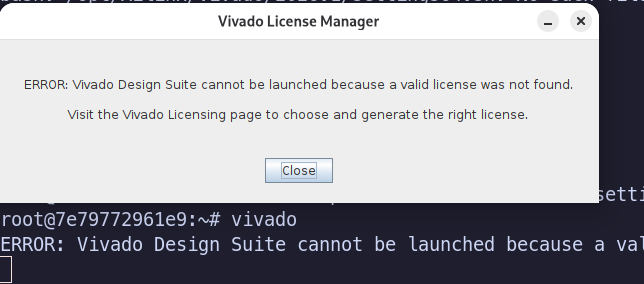

# Vivado, Vitis 2026.1

**❗ WIP (Work In Progress) ❗**

It looks like the container is working (I tested both Vivado and Vitis fo
various platforms, FPGAs and processor architectures) BUT this needs more time
to be declared as *stable* or *battle-proven*.

## License

⚠️ Unlike previous versions Vivado 2026.1 requires at least BASIC license to
open. You are required to obtain a license from (free for BASIC for now)
Xilinx and put it in container. I will add details later.

You can't even open Vivado if you don't have a license!



## Generating `install_config.txt`

**You can skip this step if you prefer edit the provided `install_config.txt`
manually which can be done any text editor.** If you want component `x` after
installation, just make sure that `x:1` in the config file.

---

The provided `Dockerfile.setup` is used to build a temporary container image for
generating `install_config.txt`.

To build this temporary image, run the following command:

```bash
sudo docker build --file Dockerfile.setup --tag vivado:2026.1-setup .
```

One option is to use the Vivado installer in batch (text) mode. To do this, you
simply need to run the container and execute `xsetup` with the appropriate
option:

```bash
sudo docker run --rm -it vivado:2026.1-setup
```

Once inside the container, run:

This will launch the batch mode installer and generate the `install_config.txt`
file. You should see a prompt similar to the following:

```bash
/tmp/installer/xsetup -b ConfigGen
```

Example output:

```text
root@7d6aa5397666:/# /tmp/installer/xsetup -b ConfigGen
This is a fresh install.
Running in batch mode...
+---------------------------------------------------------------------------+
|                  AMD Installer for FPGAs & Adaptive SoCs                  |
|---------------------------------------------------------------------------|
|                    Build Date:  2026-05-27 11:41:04 UTC                   |
|                    Branch:      2026.1                                    |
|                    Version:     f57d91f                                   |
|                                                                           |
| Copyright (c) 1986-2022 Xilinx, Inc. All rights reserved.                 |
| Copyright (c) 2022-2025 Advanced Micro Devices, Inc. All rights reserved. |
+---------------------------------------------------------------------------+

WARN  - WARNING: You are running this installer as the root user.
WARN  - It is recommended to run the installer as a regular user to avoid potential security risks.

Select a Product from the list:
1. Vitis
2. Vivado
3. Vitis Embedded Development
4. BootGen
5. Lab Edition
6. Hardware Server
7. Power Design Manager (PDM)
8. On-Premises Install for Cloud Deployments
9. Documentation Navigator (Standalone)

Please choose: 1
INFO  - Config file available at /root/.Xilinx/install_config.txt. Please use -c <filename> to point to this install configuration.
```

### Opening the Install GUI

GUI can't be used to generate `install_config.txt` but can be used to estimate
final size.

First, allow Docker to access your X server:

```bash
xhost +local:docker
```

Then, run the container with access to the X server:

```bash
sudo docker run --rm -it \
  -v /tmp/.X11-unix:/tmp/.X11-unix:ro \
  -e DISPLAY=${DISPLAY} \
  vivado:2026.1-setup
```

Inside the container, run the installer:

```bash
/tmp/installer/xsetup
```

## Building the image

⚠️ It is recommended to have around 300 GB free space before building the image,
depending on which components are enabled, i.e., which families of FPGAs/SoCs
will be included in the install. The final image will be between 100-150 GB but
build process needs additional temporary space, this is why you need more space.
Temporary files will be automatically removed by Docker/Podman after build.
Also build process does lots of IOPS, so if your build time will heavily
affected by your disk: SSD vs HDD.

First, download **SFD** installer from AMD:

<https://account.amd.com/en/forms/downloads/xef.html?filename=FPGAs_AdaptiveSoCs_Unified_SDI_2026.1_0616_1700.tar>

You need to accept EULA. The size is around 100 GB.

Now create a directory `installer` and put
`FPGAs_AdaptiveSoCs_Unified_SDI_2026.1_0616_1700.tar` there.

---

The Vivado installer tar lives in `./installer/` and is supplied as a *named
build context* (`vivado_installer`) rather than the main build context. It is
bind-mounted read-only during the install step, so it is never copied into an
image layer and never re-transferred as part of the main context.

---

The single `Dockerfile` above rebuilds everything in one shot (good for a clean
release build). For **local iteration**, the ~150 GB Vivado install dominates,
and relying on layer cache to skip it is fragile — in particular a `RUN
--mount` step that bind-mounts a named build context does not reliably produce a
cache hit in Buildah, so an unrelated edit (e.g. to `entrypoint.sh`) can trigger
a full re-install that takes hours.

To avoid that, the build is also provided split into two files:

- **`Dockerfile.base`** — the expensive half (install deps + the Vivado
  install). Build it **once** and tag it.
- **`Dockerfile.app`** — the cheap half (runtime packages, the `ebox` user,
  `entrypoint.sh`, labels). It does `FROM` the base image, so it **never**
  re-runs the install — a `FROM` on a tagged image is reused deterministically,
  no cache heuristics or mounts involved.

Build the base once (rebuild only when the installer or install deps change),
this will take some time...:

```bash
# Define a version tag
TAG=YYYYMMDD-<Count>  # Change this to match the current date and build count like 20260703-0

sudo docker build -f Dockerfile.base \
  --build-context vivado_installer=./installer \
  --build-arg EBOX_OCI_VERSION="$TAG" \
  -t vivado-base:2026.1-$TAG \
  --progress=plain . \
  2>&1 | tee build-base.log
```

Then build the app image:

```bash
sudo docker build -f Dockerfile.app \
  --build-arg EBOX_OCI_VERSION="$TAG" \
  --build-arg BASE_IMAGE="vivado-base:2026.1-$TAG" \
  -t vivado:2026.1-$TAG \
  --progress=plain . \
  2>&1 | tee build-app.log
```

For Podman just replace `docker build` with `podman build`

`--build-context` requires `docker buildx` (BuildKit, default in recent Docker)
or `podman`/`buildah` >= 4.x.

### Skipping the MD5 check

By default the build verifies the installer tar against a known MD5 before
extracting it, which reads all ~100 GB and adds noticeable time. If you have
already verified the download yourself (or simply don't need the check during
local development), skip it with `--build-arg SKIP_MD5=1`.

## Using the image

Details given in [Vivado 2024.1 README](../2024.1/README.md). Steps are the
same.

For Docker:

First allow X11 access for GUI

```bash
xhost +local:docker
```

Then:

```bash
sudo docker run --rm -it \
  -v /tmp/.X11-unix:/tmp/.X11-unix:ro \
  -e DISPLAY=${DISPLAY} \
  vivado:2026.1-$TAG
```

Run `vivado` or `vitis` inside the container.
